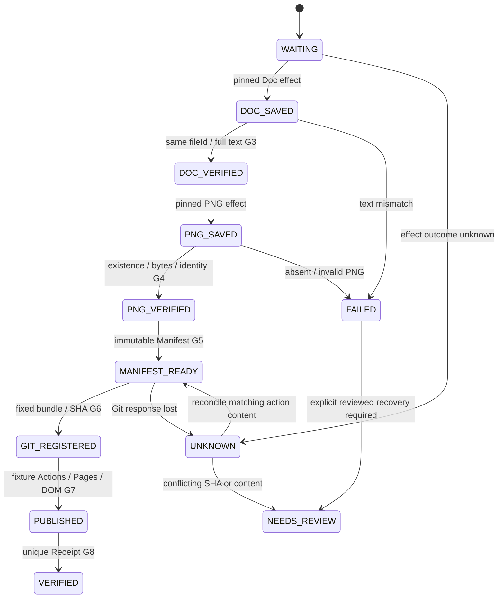

# Phase E Publisher — offline architecture and schema v1

2026-10-06. Authority: `project-control/PHASE_E_SOURCE_SPEC.md`. This design extends the accepted A/B/D/C foundation without changing formal Drive documents or connecting to production. Implementation is `scripts/reporting/publisher.py`; CLI is `scripts/publish_report_dry_run.py`.

## Architecture and responsibility

Explicit ReportContext + immutable MarketDataSnapshot + original ReportObject + supplied PNG bytes → G0/G1/G2 → durable identity claim → pinned Doc save/readback G3 → pinned PNG save/readback G4 → immutable Manifest G5 → fixed artifact Git registration G6 → supplied simulated Actions/Pages/DOM G7 → Receipt G8.

DryRunPublisher orchestrates ordering and retains the identity. FixtureStore models external effects and journal checkpoints in SQLite, with a separate SQLite lock held during a run. Unique `(report_id, revision)`, transaction_id and action_id constraints plus exclusive execution prevent racing duplicate writes. The lock is released by process exit/crash, rather than relying on expiring a guessed lease. SQLite synchronous=FULL commits preserve intent, effects, and checkpoints independently. A failure between effect and checkpoint is recoverable by action ID reconciliation.

No live adapter can be injected. No network, Drive connector, subprocess Git, push, Actions trigger, Pages deploy, production projection writer, or market fetch exists in the Publisher. The CLI requires `--dry-run` and accepts only a marked `publisher-fixture-*` directory outside the repository. Simulated SHA, deployment and DOM evidence are labelled `simulation: true`; they do not prove a real publication.

Doc/PNG names are display metadata. Identity selection uses a transaction action ID and persisted fileId. Retry re-reads the same persisted artifacts, verifies their contents and identity, and continues from the checkpoint; it never selects another file by title/name. Reverification is permitted; repeating a successful save/register is not. G0–G2 run before any artifact effect. Protected 2026-10-02_21-00 is refused before a claim or save; its existing JSON is only read by the protection test.

## State machine



Normal states: WAITING, DOC_SAVED, DOC_VERIFIED, PNG_SAVED, PNG_VERIFIED, MANIFEST_READY, GIT_REGISTERED, PUBLISHED, VERIFIED. Exceptional states FAILED / UNKNOWN / NEEDS_REVIEW retain the last successful checkpoint and pending action. UNKNOWN can occur at any effect; lookup must be decisive before retry. In the fixture, matching persisted content proves PRESENT and the exclusive SQLite table proves absence. An inconclusive lookup keeps UNKNOWN without another write. FAILED and NEEDS_REVIEW have no automatic destructive reset; corrected publication requires reviewed recovery or a new revision. Input drift is rejected without corrupting the already accepted transaction.

By default the first offline CLI run stops at GIT_REGISTERED with Receipt absent. Explicit simulated publication evidence can exercise PUBLISHED/VERIFIED in tests. PUBLISHED here means the fixture G7 evidence passed; production PUBLISHED is NOT_RUN. Passed observations are persisted at PUBLISHED, so a restart before Receipt can use them without requesting a new publication observation. Changed observations after PUBLISHED require review. Same identity after VERIFIED returns the same records. A later revision is separately claimed; any attempt to run a lower revision after a higher claim is rejected. This conservative rule also blocks old revision retry until review, even if the newer revision has not published.

## Schemas and hash rules

All datetimes are explicit timezone-aware ISO8601. `revision` is a positive integer. JSON canonical hash = SHA-256 of UTF-8, sort_keys, compact separators, ensure_ascii=False, allow_nan=False (existing snapshot.digest). body_hash = SHA-256 of the exact raw original full_text UTF-8; it is not a normalized body hash.

### Transaction identity / envelope

```text
Identity (frozen):
  report_id: string
  revision: integer > 0
  snapshot_id: string (content-addressed snapshot)
  body_hash: 64 lowercase hex
  transaction_id: "transaction-" + canonical_sha256(Identity)

Frozen input envelope:
  context: ReportContext
  snapshot: MarketDataSnapshot
  report: ReportObject
  png_base64: string (provided bytes; never generated from live data)
  envelope_hash: canonical_sha256(envelope)

Pinned artifact identity after G5:
  Identity + drive_file_id + png_file_id + manifest_id
  action_id for each effect = transaction_id + ":" + doc|png|manifest|git|receipt
```

Envelope comparison also rejects changed PNG bytes or non-identity context/report fields on retry. Original context/snapshot/report schemas remain unchanged. Deep-frozen returned Manifest/Receipt prevent caller mutation; stored effects are insert-only through the production-independent fixture API and compared on every retry.

### Doc / PNG fixture records

```text
Doc:
  file_id, report_id, revision, snapshot_id, body_hash,
  full_text, drive_url
PNG:
  file_id, report_id, revision, snapshot_id, body_hash,
  filename="マーケットレポート_<report_id>.png", png_base64
```

G3 compares original fullText with the full same-fileId readback. Only CRLF→LF and removal of one terminal LF are allowed (the existing v1.8 normalize function). Extra blank lines, lone CR, punctuation, spaces and numbers remain significant. G4 requires modeled existence, same saved/read ID, all four identity fields, exact filename, PNG signature/chunk bounds/CRC/IHDR/IEND/zlib pixel structure and expected PNG byte hash. Unsupported PNG encodings fail closed. The fixture uses a synthetic 1×1 PNG; it proves byte/identity/ordering checks, not visual correctness of a real report render or actual Drive existence.

### Publication Manifest (immutable)

```text
manifest_id: "manifest-" + canonical_sha256(fields_before_manifest_id)
report_id: string
report_date: YYYY-MM-DD
report_time: HH:MM
revision: positive integer
snapshot_id: string
body_hash: raw full_text SHA-256
drive_file_id: pinned Doc ID
drive_url: same Doc ID URL
png_file_id: pinned PNG ID
png_filename: official filename
png_hash: PNG bytes SHA-256
created_at: aware timestamp fixed at initial transaction creation
status: READY_FOR_PUBLICATION
```

manifest_hash = canonical_sha256(entire Manifest including manifest_id). Generation occurs only after G0–G4 and before Git. Retry uses the original created_at, so IDs/hashes do not change with execution time. Manifest.status remains READY_FOR_PUBLICATION after publication; runtime progress belongs to journal/Receipt, not Manifest edits.

### Git registration / bundle (fixture)

```text
manifest_id, manifest_hash,
bundle: {manifest, manifest_hash, report, doc, png},
bundle_hash: canonical_sha256(bundle),
git_commit_sha: 40 lowercase hex (SIMULATED content record),
simulation: true
```

The simulated SHA = SHA-1("offline-fixture-git:" + bundle_hash). It is explicitly NOT an actual Git commit. Registration uses only pinned artifacts. G6 checks exact ReportObject fixture projections; Phase F projection migration is not implemented. Lost response produces UNKNOWN with the Git action pending and checkpoint MANIFEST_READY. Retry finds the prior record and compares both SHA and the complete bundle, then records GIT_REGISTERED without inserting another Git effect. A conflicting/ambiguous result stops at NEEDS_REVIEW/UNKNOWN.

### Publication Receipt (immutable, post-G7 only)

```text
receipt_id: "receipt-" + canonical_sha256(G8_receipt_fields)
manifest_id: string
manifest_hash: entire immutable Manifest hash
report_id: string
revision: integer
git_commit_sha: same registered SHA
pages_deployment_id: nonempty ID from supplied G7 fixture
published_at: aware timestamp
verified_at: aware timestamp >= published_at
portal_url: HTTPS URL
dom_validation_status: PASS
final_status: VERIFIED
```

The Receipt links snapshot/body/Doc/PNG through manifest_id+manifest_hash. No Receipt is generated before Git/Actions/Pages/DOM checks. Successful Receipt is unique by transaction action ID. Failed/unknown attempts reside in the journal, rather than creating a prepublication successful Receipt. Formal FAILED/UNKNOWN receipt policy for real publication remains a future design decision.

### Durable journal

```text
report_id, revision, transaction_id,
envelope, envelope_hash,
state, checkpoint,
created_at,
pending_action: nullable stable action ID,
error: nullable reason,
events: ordered state/at observations,
failure_evidence: nullable normalization/comparison failure details,
publication_evidence: nullable immutable passed Actions/Pages/DOM fixture,
manifest, manifest_hash: nullable until G5,
git_commit_sha: nullable until G6,
receipt: nullable until G8
```

SQLite tables: transactions PRIMARY KEY(report_id,revision)/UNIQUE(transaction_id); effects PRIMARY KEY(action_id),kind,payload. A separate runner-lock.sqlite transaction serializes orchestration. Fixture events use the explicit injected fixture timestamp; they are not live execution telemetry. A checkpoint claiming a missing effect/Manifest/SHA/Receipt/observation fails at NEEDS_REVIEW without recreating artifacts. Successfully reconciled UNKNOWN restores the prior successful state even when no new checkpoint is needed. Storage must be retained for idempotency: deleting the fixture database destroys its memory. Retention/backups and distributed locks for real deployment require separate approval/design.

## Future real adapter contract (design only, NOT_RUN)

Future ports must accept stable action IDs and return PRESENT / ABSENT_PROVEN / AMBIGUOUS / UNKNOWN. A search returning no result is insufficient proof of absence when the service is eventually consistent. Durable unique identity ownership and a write-ahead intent are required before any create. Doc target selection requires an explicit registry binding of report_id+revision and immutable action metadata, then pinned fileId readback; duplicate matches stop at NEEDS_REVIEW. Names never establish canonical identity. Never guess either protected OLD/NEW ID.

Drive: save original full text to the bound target, read metadata/full text by the returned same fileId, compare with G3; save the rendered PNG with four-field identity/provenance, fetch same ID bytes and metadata with G4. Live renderer must prove it consumed the frozen body/snapshot; merely attaching metadata does not prove PNG pixels match the body.

Git: stage only a reviewed mapping of the fixed bundle; before commit persist expected parent/tree, action ID and Manifest hash. On lost response search/read the existing commit by durable action reference and compare SHA, tree, blob hashes, Manifest identity and expected parent/branch. Only authoritative absence permits retry; multiple/conflicting commits require review. GitHub main/push are separate approved actions. Never rerun acquisition or choose another Doc/PNG.

Publication: collect same-commit Actions success, deployment ID/SHA and actual portal/DOM observations; preserve UNKNOWN on timeouts and reconcile before retry. Only after G7 may successful G8 Receipt be durably recorded. Retry after a verified public result checks existing Receipt before another create.

## Phase F entry conditions

1. User explicitly authorizes Phase F scope; Phase E acceptance itself grants no production access.
2. Define Manifest→canonical/index/latest/dashboard projection mapping and consumer schemas, with immutable identities and rollback rules; current G6 exact fixture copies are not a production migration.
3. Decide existing unsafe canonical writer treatment in a separate reviewed change; do not bypass it accidentally or claim it fixed here.
4. Choose shared durable journal/lock/retention and authoritative reconciliation sources for real adapters, plus failed/unknown/review recovery policy.
5. Agree original Chat body ingestion / typed market table body compatibility and PNG renderer provenance/encoding.
6. Keep protected 2026-10-02_21-00 excluded until separate evidence resolves canonical identity; both IDs remain uncertified.
7. Specify nonproduction acceptance first, then separately authorize any Drive/GitHub/Pages writes. Collect real same-fileId, byte, SHA, deployment and DOM proof before claiming E5 publication.

Phase F–H code and live publication are deliberately absent in this Phase E deliverable.

## Reproducible acceptance

`run_phase_e_acceptance.py --node <Node executable> --evidence-dir <external evidence directory>` requires the read-only pre-work `production-baseline.json`; it never overwrites that baseline. Every run uses a fresh timestamped fixture namespace under evidence/runs, retaining old SQLite recovery records, so acceptance can be repeated without erasing a previous successful transaction. Latest logs/acceptance/scenario/proof files summarize the most recent run. Test temporary files use the writable external evidence/temp path.
