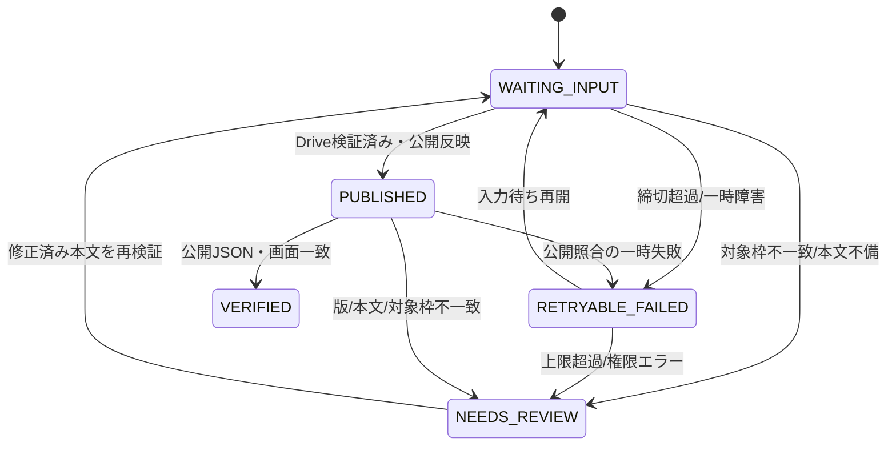

# マーケットレポート配信システム 仕様書

文書版: v1.3
基準コミット（配信リポジトリ）: 096281404b06c3c67d0398ec1010e72abb85c09e
基準設定: `config/report_schedule.json`

## 1. システム構成

```
対象枠を固定したジョブ
        ↓
本文・構造化入力の作成
        ↓
共通事前検証
        ↓
Google Drive保存 → file IDで再読取・ハッシュ照合
        ↓
正本 reports/<reportId>.json
        ↓
単一publisherが派生JSONを生成
        ↓
GitHub Pages公開
        ↓
JSONと公開画面の照合
        ↓
VERIFIED
```

Google Driveの本文は入力証跡と人が読む正本、`reports/<reportId>.json` は公開採用版の正本とする。`latest-report.json`、`reports.json`、`dashboard.json` は公開用の派生物であり、派生物から本文や正本を再構成しない。

## 2. 本番コンポーネント

### 2.1 Google Drive

- 保存先フォルダー: `WEBマーケットレポート`。
- 本文の採用はフォルダー、記録済み `driveFileId`、対象枠、本文ハッシュを組み合わせて行う。
- 同名だけで採用版を決めない。
- 保存直後に本文を再読取し、保存先・対象時刻・本文ハッシュ・Drive版を確認する。

### 2.2 Apps Script

| ファイル | 役割 |
|---|---|
| `MarketReportAutoPublish.gs` | 対象枠のトリガー、本文検出、状態記録、再試行、旧市場レポートトリガーの整理 |
| `MarketReportWebSync.gs` | 本文の解析、Reportオブジェクト生成、GitHub発行処理との連携 |
| `MarketReportStructuredImport.gs` | 本文の見出し、インラインシナリオ、主要市場、ニュース等を構造化 |
| `MarketReportPrePublishValidation.gs` | 対象時刻、必須項目、別名、未来枠、本文・版の共通検証 |
| `DashboardJsonSync.gs` | 未来枠を現在の最新表示へ採用しないダッシュボード同期 |
| `ParserPatch.gs` | 旧重複パーサーを無効化した互換ファイル。新しい解析処理を追加しない |

### 2.3 GitHub公開物

レポートは次の関係で管理する。

- 正本: `reports/<reportId>.json`
- 履歴一覧: `reports.json`
- 最新表示: `data/latest-report.json`
- 分析ダッシュボード: `data/dashboard.json`

4ファイルのレポートオブジェクトは対象枠・版・本文ハッシュ・主要構造項目が一致していなければならない。

## 3. スケジュール仕様

タイムゾーンは `Asia/Tokyo` とする。

| 曜日 | 本発行枠 | 主トリガー | 再試行トリガー |
|---|---|---|---|
| 月〜金 | 08:00 | 08:00枠 | 09:30 |
| 月〜金 | 12:00 | 12:00枠 | 13:30 |
| 月〜金 | 16:00 | 16:00枠 | 17:30 |
| 月〜金 | 21:00 | 21:00枠 | 22:30 |
| 土 | 08:00 | 08:00枠 | 実行時エラー時に状態から再開 |
| 日 | なし | なし | なし |

本番Apps Scriptでは、本発行4件、再試行4件、5分間隔のwatchdog 1件の合計9トリガーを使用する。旧 `runMarketReportMaster...`、旧 `MRWEB3...` の市場レポート自動発行ハンドラは併用しない。USD/JPY等の別用途トリガーは市場レポート発行とは別系統として保持する。

過去互換の07:00・09:00は履歴の読み取り・検証に残せるが、現行枠の作成・期待値・監視へ混ぜない。

## 4. データ契約

### 4.1 ジョブ台帳の最小項目

```json
{
  "reportId": "YYYY-MM-DD_HH-MM",
  "reportDate": "YYYY-MM-DD",
  "reportSlot": "08:00",
  "timezone": "Asia/Tokyo",
  "scheduledAt": "YYYY-MM-DDTHH:MM:00+09:00",
  "generatedAt": "YYYY-MM-DDTHH:MM:SS+09:00",
  "marketDataAsOf": "YYYY-MM-DDTHH:MM:SS+09:00",
  "revision": 1,
  "schemaVersion": "1.0",
  "sourceSnapshotId": "source-snapshot-id",
  "bodyHash": "sha256-hex",
  "driveFileId": "google-doc-id",
  "driveRevision": "drive-revision-id",
  "driveVerifiedAt": "YYYY-MM-DDTHH:MM:SS+09:00",
  "stage": "WAITING_INPUT",
  "attempt": 0,
  "nextRetryAt": null,
  "lastErrorCode": null,
  "gitCommit": null,
  "deploymentId": null,
  "publicVerifiedAt": null
}
```

`generatedAt` は本文作成時刻、`marketDataAsOf` は本文が参照した市場データの時点、`scheduledAt` は対象枠の予定時刻であり、同じ値で代用しない。

### 4.2 Reportオブジェクト

必須の構造化項目は次の通りとする。

`summary`, `theme`, `changes`, `consistency`, `leadingMarket`, `news`, `rates`, `crossAssetFlow`, `positioning`, `events`, `markets`, `mainScenario`, `alternativeScenario`, `breakConditions`, `handover`, `conclusion`, `riskManagement`, `marketDataTable`, `fullText`

`markets` は通常、金、WTI原油、日経225先物（大阪取引所）、USD/JPY、EUR/USD、BTCUSDを独立要素として持つ。取得不能は `status`、理由、基準日、確認時刻を保持し、0や推測値に置き換えない。

### 4.3 本文別名

構造化インポートは、次の表記を共通項目へ変換する。

| 本文表記 | 変換先 |
|---|---|
| `シナリオ分析` 内の `メイン：` | `mainScenario` |
| `シナリオ分析` 内の `代替：` | `alternativeScenario` |
| `崩れる条件：` | `breakConditions` または `riskManagement` |
| `主要市場の確認値` | `marketDataTable` |
| `重要ニュース・金利` | `news` と `rates` |
| `16:00から21:00のマーケットの動き` | `changes` または時刻間変化 |
| `明日への引き継ぎ` | `handover` |

別名変換は1か所で実施し、自動発行と手動発行で異なる変換結果を作らない。

## 5. 状態遷移



### 5.1 遷移条件

- `WAITING_INPUT`: 期限前に本文を待つ。本文がないことを成功としない。
- `RETRYABLE_FAILED`: 429、5xx、通信切断、GitHub競合など。既存の保存状態を照合してから再試行する。
- `NEEDS_REVIEW`: 認証・権限、対象時刻、構造欠落、ハッシュ不一致、重複採用など。自動で検証を外して進めない。
- `PUBLISHED`: 検証済みコミットが公開された状態。画面確認はまだ完了していない。
- `VERIFIED`: 配信4点と公開画面が対象版と一致した状態。

## 6. 検証仕様

### 6.1 入力検証

1. ファイル名、本文見出し、ジョブの `reportId` が一致する。
2. 本文の対象時刻が将来枠ではない（保存は可、現在最新への採用は不可）。
3. 必須セクション、6市場、シナリオ、引き継ぎ、結論が存在する。
4. 正当な取得不能は理由付き状態として保持する。
5. `bodyHash`、`driveFileId`、`driveRevision` が台帳と一致する。

### 6.2 発行検証

1. 正本履歴と4つの公開投影の日時が一致する。
2. `revision` と `bodyHash` が一致する。
3. `dashboard.currentReportKey` は公開時点で最大の確定枠を指す。
4. 将来枠を `dashboard` の現在値に採用しない。
5. 1コミットに必要な生成物をまとめ、部分更新を公開完了にしない。

### 6.3 公開後検証

- 公開JSONを取得し、対象 `reportId`、対象時刻、タイトル、本文、主要市場表、シナリオを確認する。
- 公開ページで状態表示、更新時刻、本文と表の一致を確認する。
- CDNやブラウザーの旧キャッシュが残る場合は `VERIFIED` にせず再確認する。

## 7. エラーコードと再試行

| コード例 | 意味 | 処理 |
|---|---|---|
| `INPUT_NOT_FOUND` | 本文未着 | 締切前は待機、締切後は未発行として記録 |
| `SLOT_MISMATCH` | 対象時刻不一致 | `NEEDS_REVIEW`。別枠へ流さない |
| `SCHEMA_INVALID` | 必須構造欠落 | 本文または変換を修正して再検証 |
| `DRIVE_READBACK_MISMATCH` | 保存後本文/ハッシュ不一致 | 公開停止、保存工程を確認 |
| `AUTH_REQUIRED` | 認証・権限切れ | 再試行せず設定修正待ち |
| `RATE_LIMIT` / `HTTP_5XX` | 一時通信障害 | 上限付き指数バックオフ |
| `GITHUB_CONFLICT` | 競合 | 最新HEADを読み直し、同じ正本から再生成 |
| `PUBLIC_VERIFY_MISMATCH` | 公開先が旧版または別版 | `VERIFIED` にせず照合を再実行 |

再試行上限に達したジョブは保留キューへ残し、正常完了件数へ含めない。

## 8. 実装・デプロイ仕様

### 8.1 変更単位

GitHubの変更はレビュー済みのPRをmainへマージし、Apps Scriptへ同じ機能版を保存する。2026-09-25復旧後の配信基準コミットは `226a9b97b07dff9f5ecaa0ab822e815ebae4b03a` とする。

### 8.2 Apps Script反映

1. 対象ファイルを保存する。
2. `ParserPatch.gs` が旧パーサーを呼び出していないことを確認する。
3. `installMarketReportAutoPublishTriggers()` を1回実行する。
4. 本発行4件、再試行4件、5分間隔のwatchdog 1件、合計9件が各1件あることを確認する。
5. 旧市場レポートハンドラが残っていないことを確認する。
6. 実行ログとトリガー一覧をDriveの反映記録へ残す。

### 8.3 ロールバック

公開不一致が解消しない場合、直前の正常なGitHubコミットとApps Scriptの直前版へ戻す。途中ジョブ、Drive本文、失敗原因は削除しない。ロールバック後も公開JSONと画面を再検証し、`VERIFIED` を付け直す。

## 9. 既知の制限

- 既存履歴の旧形式・必須項目不足は、現行の厳密検証で失敗する。過去データを自動推測で補う仕様にはしない。
- 本番反映後の初回ライブレポートは、公開確認と実行ログの観察が完了するまで運用目標の達成値とはみなさない。
- Apps ScriptとGitHub Actionsが同一の排他制御を共有しないため、単一publisherと正本照合で競合を抑える。

## 10. TradingView MCP入力アダプター

### 10.1 位置づけ

TradingView MCPは入力側の読み取りアダプターであり、公開ファイルを直接更新しない。CodexまたはChatGPTの対話から取得する経路と、定時ジョブから無人取得する経路は分けて検証する。OAuthを保持できない環境では、TradingView MCPを定時処理の唯一の入力元にしない。

### 10.2 対象ツールと正規化

| MCP機能 | 正規化先 | 必須記録 |
|---|---|---|
| OHLCV | `markets[*].ohlcv` | `source`、銘柄、足種、バー時刻、取得時刻 |
| テクニカル評価 | `markets[*].technicals` | 指標名、時間足、取得時刻、設定 |
| 経済指標 | `rates` または `events` | 指標コード、国、発表日、単位、値 |
| ニュース | `news` | 見出し、提供元、公開時刻、参照ID |
| スクリーナー | `markets` または補助資料 | 条件、取得時刻、対象集合 |

取得結果の最小形は次の通りとする。

```json
{
  "source": "tradingview_mcp",
  "symbol": "EXCHANGE:TICKER",
  "interval": "1D",
  "barTimestamp": "UTC timestamp",
  "fetchedAt": "UTC timestamp",
  "sourceSnapshotId": "stable-id",
  "tool": "get_ohlcv",
  "status": "ok"
}
```

TradingViewのバー時刻はUTCとして保存し、表示時だけ `Asia/Tokyo` へ変換する。銘柄検索で解決できない場合は失敗として扱い、別銘柄を推測しない。

### 10.3 データ優先順位

1. 同じ対象時刻・同じ銘柄・同じ単位で検証済みの取得結果。
2. TradingView MCPの取得結果（試験中は照合済みの補助値）。
3. 既存の検証済みデータ源。
4. 取得不能（理由付き）。

本番入力元への昇格は項目単位で行う。OHLCV、テクニカル、経済指標、ニュースを一括で切り替えない。

### 10.4 失敗と制限

- ツール呼び出しのレート制限は、取得対象をまとめ、同一スナップショットを再利用する。
- OAuth再認証が必要な場合は `AUTH_REQUIRED` として停止し、無限再試行しない。
- 取得結果に権限制限やペイウォールがある場合は本文へ断定的に取り込まず、取得不能理由を残す。
- MCP取得後も、Drive本文保存、正本化、単一publisher、公開後照合を必須とする。

### 10.5 パイロット完了条件

- USD/JPYと金で10稼働日の比較を終える。
- 既存データ源との時刻、単位、価格差、欠損件数を記録する。
- OAuth再認証、レート制限、未解決銘柄、取得遅延を再現・分類する。
- 定時ジョブから取得しても同じ `sourceSnapshotId`、版、本文ハッシュを追跡できる。
- 合格後に対象項目を本番入力元へ昇格し、切り替え記録を残す。

## 11. 取得元ポリシーとロールバック

設定ファイル `config/market_data_source_policy.json` を取得元の単一設定とする。出荷時の `sourceMode` は `legacy_only`、`activeSource` と `publishSource` は `legacy_verified` とする。TradingViewは `shadow` で比較するまで公開経路に入れない。

取得元の解決結果には `mode`、`source`、`publishSource`、`rolledBack`、`reason` を含める。`AUTH_REQUIRED`、`RATE_LIMIT`、`TIMEOUT`、`SYMBOL_NOT_FOUND`、`DATA_MISMATCH`、`STALE_DATA`、`SCHEMA_INVALID` のいずれかを検知した場合、`rollback.enabled=true` なら `legacy_verified` へ戻す。復帰先は設定で固定し、TradingViewだけを復帰先に指定できないよう検証する。

本番昇格には10稼働日の比較、OAuth、レート制限、取得元スナップショット、既存データ源への復帰試験を要求する。設定変更は監査ログへ記録し、同じ `reportId` の本文・公開JSON・分析画面を後から別の取得元で上書きしない。

## 12. 2026-09-25復旧で確定した公開同期仕様

### 12.1 実行と再試行

本発行枠は平日08:00・12:00・16:00・21:00、土曜08:00である。Apps Scriptの本発行トリガーは各枠の30分付近に設定され、再試行は09:30・13:30・17:30・22:30付近で実行される。トリガー時刻は実行予定であり、reportSlotは予定発行枠として保持する。曜日・日付・時刻の判定はAsia/Tokyoで行う。

Apps ScriptのautoPublishMarketReportsWatchdogは5分間隔で期限到来済みの対象枠を再確認する。本文が不在または不完全、画像が不在または別枠の場合は公開しない。GitHub ActionsのMarket report publication watchdogは対象枠の正本、reports.json、dashboard.jsonを再照合し、履歴と順序も検証する。

### 12.2 正確な本文・図解対応

- 一意キーはYYYY-MM-DD_HH-MMとする。
- タイトルは「マーケットレポート｜YYYY/MM/DD（曜日）HH:MM」とする。
- 正本のdate/time、画像のslotKey、ファイル名の対象枠が一致しなければならない。
- 対応画像は既存の対象枠画像を利用する。別スロット画像へのフォールバックや自動再生成はしない。
- 一覧は日付降順、同一日は21:00、16:00、12:00、08:00の順とする。
- 原本不在枠は対象データなしとし、別レポートを表示しない。21:00の原本がない場合も空の正本を作成しない。

### 12.3 本文原文アーカイブの互換条件

既存のChatGPT原文を保全する移行では、08:00・12:00・16:00に限り、完全なfullTextが1,200文字以上であれば、marketsの構造化値を推測して作らずに原文形式として警告付きで受け入れられる。この例外は過去原文の取り込み用であり、新規本文で構造化項目を省略する許可ではない。21:00は既存の厳格な構造化要件を維持する。

### 12.4 成功判定と工程記録

1. 本文の生成完了を確認する。
2. 指定Driveフォルダーへ保存し、対象ファイルIDで本文を再読取して対象枠・内容を確認する。
3. 対象枠と一致するDrive保存記録を確認する。対象期間で記録がない場合はBuild report indexを停止する。
4. 正本、reports.json、data/latest-report.json、data/dashboard.jsonを同じ版から更新する。
5. GitHub commitとPages deployの成否を確認する。
6. 公開URLの本文と画像を取得し、対象枠・タイトル・本文・図解バイト列を照合してからVERIFIEDとする。

Drive保存、GitHub反映、deployのいずれか一工程のみの成功を全体の成功として報告しない。

### 12.5 障害原因と運用上の扱い

2026-09-25は08:00本文が定時検証時に不完全であり、12:00・16:00本文は各予定枠の処理時点でDrive上に見つからなかった。後刻のDrive保存とポータル同期が連動せず、再試行もなかったため未反映になった。21:00本文と同時間帯の図解はDriveにあったが、公開前パーサーの誤検出で本文解析・必須項目検証に失敗し、GitHubへの書込み前に停止した。具体的には見出しの前方一致、小数値を見出しとする広い番号判定、市場別文章内にある価格を抽出しない処理、実本文の見出し別名不足が重なった。JSTのキーで照合しており、UTC変換ずれではない。保存後の再確認、watchdog、保存記録ゲート、公開後のJSON・画像検証に加え、本文形式を使うパーサー回帰テストで再発を抑止する。

### 12.6 本文解析と公開前検証

- 見出しは空白・句読点・全角数字を正規化したうえで、既知の完全一致または登録済み別名により判定する。本文の先頭語が見出しと一致するという理由だけで段落を切り捨てない。
- 番号付き見出しは見出し番号として許可した形式に限る。小数値、価格、為替レートを含む行を見出しと判定しない。
- 市場別本文から価格を抽出する場合は市場ラベルから次の市場ブロックまでに範囲を限定し、明示された単位・精度を確認する。別市場の価格や他時間帯の値を流用しない。
- 実際の21:00本文形式を含むパーサー・公開前検証テストをCIで実行する。Driveに本文があることだけで公開可能とは判定せず、必須項目検証に合格して初めてGitHub発行へ進む。

改訂: v1.3 2026-09-25の21:00公開前解析障害と回帰テストを追加。v1.2の実行監視、完全キーの画像対応、原文移行例外、保存から公開確認までの工程ゲートを継承。

以上

