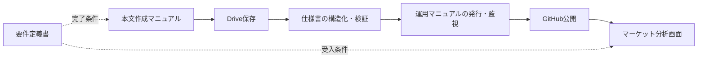

# マーケットレポート配信システム 文書体系・索引

文書版: v1.3
基準コミット（配信リポジトリ）: 096281404b06c3c67d0398ec1010e72abb85c09e
対象システム: 本文作成 → Google Drive保存 → 構造化 → GitHub反映 → マーケット分析表示
適用基準: 改善後の本番構成

## 1. 文書体系

本システムは、本文の作成から公開後確認までを一つの業務システムとして扱う。文書は役割ごとに分冊し、共通の対象枠、状態、版、データ契約を使用する。

| 文書 | 役割 | 主な利用者 | 変更の起点 |
|---|---|---|---|
| 要件定義書 | 目的、範囲、責任、機能・非機能要件、受入条件 | 責任者、設計者 | 業務要件・受入条件の変更 |
| 仕様書 | データ契約、状態遷移、スケジュール、検証、実装・デプロイ | 設計者、保守担当 | 実装・インターフェースの変更 |
| 本文作成マニュアル | 本文の構成、時刻別の書き分け、分析表現、欠損ルール | 本文作成者、レビュー担当 | 本文テンプレート・分析ルールの変更 |
| 運用マニュアル | 保存、発行、監視、障害復旧、ロールバック | 運用担当、当番 | 運用手順・障害対応の変更 |

## 2. 正式な参照順

1. 要件定義書で、目的・範囲・完了条件を確認する。
2. 仕様書で、対象枠、データ項目、状態、検証条件を確認する。
3. 本文作成マニュアルで、対象時刻の本文を作成する。
4. 運用マニュアルで、Drive保存、公開、監視、復旧を実行する。

文書間で矛盾がある場合は、要件定義書の業務要件、仕様書のデータ・状態契約、本文作成マニュアルの記述ルール、運用マニュアルの手順の順に、担当領域を分けて解消する。1文書だけを変更して完了にしない。

## 3. 共通のシステム契約

- タイムゾーン: `Asia/Tokyo`
- 新規発行枠: 平日08:00・12:00・16:00・21:00、土曜08:00、日曜なし
- 対象識別子: `reportId=YYYY-MM-DD_HH-MM`
- 版識別: `revision`、`schemaVersion`、`bodyHash`
- 保存証跡: `driveFileId`、`driveRevision`、再読取時刻
- 状態: `WAITING_INPUT`、`RETRYABLE_FAILED`、`NEEDS_REVIEW`、`PUBLISHED`、`VERIFIED`
- 公開正本: `reports/<reportId>.json`
- 派生公開物: `reports.json`、`latest-report.json`、`dashboard.json`

本文の必須構造、対象時刻、データ基準日、保存本文、公開JSON、公開画面は、同じ `reportId` と版で照合できなければならない。

## 4. 処理の対応関係

本文作成で確定した対象時刻・データ基準日・本文構造を、保存・構造化・公開で作り直さない。Drive保存後の再読取結果を、発行と公開確認の入力にする。

## 5. 変更管理

次の変更は、影響する文書を同じ版で更新する。

| 変更 | 更新する文書 |
|---|---|
| 新しい発行時刻、曜日、締切 | 要件定義書、仕様書、本文作成マニュアル、運用マニュアル |
| 本文の必須セクション、見出し別名 | 要件定義書、仕様書、本文作成マニュアル |
| `reportId`、revision、JSON項目 | 要件定義書、仕様書、運用マニュアル |
| Drive保存、再読取、レシート | 要件定義書、仕様書、運用マニュアル |
| 本文テンプレート・市場分析の記述規則 | 要件定義書、本文作成マニュアル、仕様書 |
| 障害復旧、トリガー、ロールバック | 仕様書、運用マニュアル |

変更後は、本文作成、Drive再読取、構造化検証、公開4点照合、公開画面確認を通した回帰確認を行う。旧版の本文や保存証跡を後付けで書き換えない。

## 6. 利用開始時のチェック

- [ ] 4文書が同じ文書版を参照している
- [ ] 対象時刻とタイムゾーンが一致している
- [ ] 本文の必須項目と構造化項目が一致している
- [ ] Drive保存後の再読取が公開ゲートに含まれている
- [ ] 正本と派生公開物の関係が一致している
- [ ] `PUBLISHED` と `VERIFIED` を分けている
- [ ] 本文作成者と配信運用担当の責任分界が明確である

## 7. TradingView MCPの位置づけ

TradingView MCPは本システムの入力アダプターとして追加する。本文作成者は読み取り専用でデータ・分析を取得できるが、公開正本と発行処理は既存のDrive・GitHub・単一publisherが担当する。

- 要件定義書: MCP利用の目的、切り替えゲート、入力の可観測性を定義する。
- 仕様書: MCP取得項目、正規化フィールド、データ優先順位、失敗処理を定義する。
- 本文作成マニュアル: MCP値を本文へ使う際の基準時刻、銘柄、単位、欠損表記を定義する。
- 運用マニュアル: 10稼働日の比較試験、本番昇格条件、書き込みツール禁止を定義する。

試験期間中は、TradingView MCPを既存データ源と比較する補助入力とし、公開正本を自動置換しない。自動配信へ昇格する場合は、OAuth、レート制限、定時処理、フォールバック、データ利用条件を確認し、4文書を同じ版で更新する。

改訂: v1.1 TradingView MCPを読み取り専用の入力アダプターとして文書体系へ追加。

## 8. 取得元切替の共通ルール

4文書で共通する既定値は `sourceMode=legacy_only`、復帰先は `legacy_verified` とする。TradingViewの比較取得は `shadow`、昇格後の運用は `tradingview_primary`、異常時は `rollback` として記録する。認証、レート制限、タイムアウト、銘柄・データ差異、古さ、スキーマ不正を検知したら、公開前に既存データ源へ戻す。

設定ファイルとApps Scriptの監査記録は同じポリシー版で管理し、本文、Drive、GitHub、分析画面のすべてで取得元とロールバック理由を追跡できるようにする。

## 9. v1.2変更記録

2026-09-25に、定時枠で本文不完全・Drive原本未検出となった後、原本のDrive保存とポータル同期が連動せず、08:00・12:00・16:00が未反映となった。JST/UTCの変換ずれではなく、保存後の再試行と公開完了の検証が不足していた。

4文書に、Drive保存だけを完了としない工程管理、5分間隔のApps Script watchdog、GitHub Actionsの再照合、YYYY-MM-DD_HH-MMによる本文・図解対応、公開後のJSON・画像・ページ確認、原本不在枠の扱いを同じv1.2として反映した。

更新範囲:

- 要件定義書: 遅延保存後の再同期、工程の可観測性、未発行枠の受入基準。
- 仕様書: 実行・監視、完全キー、原文移行条件、保存記録ゲート、deploy後確認。
- 運用マニュアル: 9件のトリガー確認、障害切り分け、Driveから公開ページまでの復旧手順。
- 本文作成マニュアル: 正確なタイトル、保存後の公開引き渡し、対応画像、原文保全と未発行枠。

対象枠が存在しない場合は推測・空データで補わず、対象データなしとして扱う。Drive保存から公開ページ確認までの工程が一致した場合のみVERIFIEDとする。

改訂: v1.2 2026-09-25の実障害と復旧コミット226a9b97b07dff9f5ecaa0ab822e815ebae4b03aを記録。

## 10. v1.3変更記録

2026-09-25の21:00版はDrive上に完全な本文と対応図解があったが、Apps Scriptの公開前パーサーが本文を誤解析し、必須項目検証でGitHub書込み前に停止した。前方一致による本文文の見出し誤認、小数値の見出し誤認、市場別の文章内価格を抽出しない点、実本文の見出し別名不足を原因として特定し、パーサーとCI回帰テストを修正した。修正コミットは `096281404b06c3c67d0398ec1010e72abb85c09e`。

要件定義書、仕様書、運用マニュアル、本文作成マニュアルをv1.3へ改訂し、完全一致見出し判定、市場ごとに範囲を限定した価格抽出、実本文形式のCI回帰テスト、公開前検証エラーの運用切り分けを反映した。

以上

