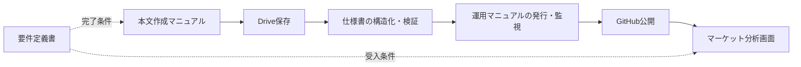

# マーケットレポート配信システム 文書体系・索引

文書版: v1.6
基準コミット（配信リポジトリ）: 096281404b06c3c67d0398ec1010e72abb85c09e
対象システム: 本文作成 → Google Drive保存 → 構造化 → GitHub反映 → マーケット分析表示
適用基準: 改善後の本番構成

## 1. 文書体系

本システムは、本文の作成から公開後確認までを一つの業務システムとして扱う。文書は役割ごとに分冊し、共通の対象枠、状態、版、データ契約を使用する。

| 文書 | 役割 | 主な利用者 | 変更の起点 |
|---|---|---|---|
| 要件定義書 | 目的、範囲、責任、機能・非機能要件、受入条件 | 責任者、設計者 | 業務要件・受入条件の変更 |
| 仕様書 | データ契約、状態遷移、スケジュール、検証、実装・デプロイ | 設計者、保守担当 | 実装・インターフェースの変更 |
| 本文作成マニュアル | 本文の構成、時刻別の書き分け、分析表現、欠損ルール | 本文作成者、レビュー担当 | 本文テンプレート・分析ルールの変更 |
| 運用マニュアル | 保存、発行、監視、障害復旧、ロールバック | 運用担当、当番 | 運用手順・障害対応の変更 |

## 2. 正式な参照順

1. 要件定義書で、目的・範囲・完了条件を確認する。
2. 仕様書で、対象枠、データ項目、状態、検証条件を確認する。
3. 本文作成マニュアルで、対象時刻の本文を作成する。
4. 運用マニュアルで、Drive保存、公開、監視、復旧を実行する。

文書間で矛盾がある場合は、要件定義書の業務要件、仕様書のデータ・状態契約、本文作成マニュアルの記述ルール、運用マニュアルの手順の順に、担当領域を分けて解消する。1文書だけを変更して完了にしない。

## 3. 共通のシステム契約

- タイムゾーン: `Asia/Tokyo`
- 新規発行枠: 平日08:00・12:00・16:00・21:00のみ。土曜・日曜は発行しない
- 朝間市場データ更新: 毎日06:30 JSTを基準とし、土曜も直近市場営業日の終値を確認する。これは土曜レポート発行を伴わない
- 対象識別子: `reportId=YYYY-MM-DD_HH-MM`
- 版識別: `revision`、`schemaVersion`、`bodyHash`
- 保存証跡: `driveFileId`、`driveRevision`、再読取時刻
- 状態: `WAITING_INPUT`、`RETRYABLE_FAILED`、`NEEDS_REVIEW`、`PUBLISHED`、`VERIFIED`
- 公開正本: `reports/<reportId>.json`
- 派生公開物: `reports.json`、`latest-report.json`、`dashboard.json`

本文の必須構造、対象時刻、データ基準日、保存本文、公開JSON、公開画面は、同じ `reportId` と版で照合できなければならない。

## 4. 処理の対応関係

本文作成で確定した対象時刻・データ基準日・本文構造を、保存・構造化・公開で作り直さない。Drive保存後の再読取結果を、発行と公開確認の入力にする。

## 5. 変更管理

次の変更は、影響する文書を同じ版で更新する。

| 変更 | 更新する文書 |
|---|---|
| 新しい発行時刻、曜日、締切 | 要件定義書、仕様書、本文作成マニュアル、運用マニュアル |
| 本文の必須セクション、見出し別名 | 要件定義書、仕様書、本文作成マニュアル |
| `reportId`、revision、JSON項目 | 要件定義書、仕様書、運用マニュアル |
| Drive保存、再読取、レシート | 要件定義書、仕様書、運用マニュアル |
| 本文テンプレート・市場分析の記述規則 | 要件定義書、本文作成マニュアル、仕様書 |
| 障害復旧、トリガー、ロールバック | 仕様書、運用マニュアル |

変更後は、本文作成、Drive再読取、構造化検証、公開4点照合、公開画面確認を通した回帰確認を行う。旧版の本文や保存証跡を後付けで書き換えない。

## 6. 利用開始時のチェック

- [ ] 4文書が同じ文書版を参照している
- [ ] 対象時刻とタイムゾーンが一致している
- [ ] 本文の必須項目と構造化項目が一致している
- [ ] Drive保存後の再読取が公開ゲートに含まれている
- [ ] 正本と派生公開物の関係が一致している
- [ ] `PUBLISHED` と `VERIFIED` を分けている
- [ ] 本文作成者と配信運用担当の責任分界が明確である

## 7. TradingView MCPの位置づけ

TradingView MCPは本システムの入力アダプターとして追加する。本文作成者は読み取り専用でデータ・分析を取得できるが、公開正本と発行処理は既存のDrive・GitHub・単一publisherが担当する。

- 要件定義書: MCP利用の目的、切り替えゲート、入力の可観測性を定義する。
- 仕様書: MCP取得項目、正規化フィールド、データ優先順位、失敗処理を定義する。
- 本文作成マニュアル: MCP値を本文へ使う際の基準時刻、銘柄、単位、欠損表記を定義する。
- 運用マニュアル: 10稼働日の比較試験、本番昇格条件、書き込みツール禁止を定義する。

試験期間中は、TradingView MCPを既存データ源と比較する補助入力とし、公開正本を自動置換しない。自動配信へ昇格する場合は、OAuth、レート制限、定時処理、フォールバック、データ利用条件を確認し、4文書を同じ版で更新する。

改訂: v1.1 TradingView MCPを読み取り専用の入力アダプターとして文書体系へ追加。

## 8. 取得元切替の共通ルール

4文書で共通する既定値は `sourceMode=legacy_only`、復帰先は `legacy_verified` とする。TradingViewの比較取得は `shadow`、昇格後の運用は `tradingview_primary`、異常時は `rollback` として記録する。認証、レート制限、タイムアウト、銘柄・データ差異、古さ、スキーマ不正を検知したら、公開前に既存データ源へ戻す。

設定ファイルとApps Scriptの監査記録は同じポリシー版で管理し、本文、Drive、GitHub、分析画面のすべてで取得元とロールバック理由を追跡できるようにする。

## 9. v1.2変更記録

2026-09-25に、定時枠で本文不完全・Drive原本未検出となった後、原本のDrive保存とポータル同期が連動せず、08:00・12:00・16:00が未反映となった。JST/UTCの変換ずれではなく、保存後の再試行と公開完了の検証が不足していた。

4文書に、Drive保存だけを完了としない工程管理、5分間隔のApps Script watchdog、GitHub Actionsの再照合、YYYY-MM-DD_HH-MMによる本文・図解対応、公開後のJSON・画像・ページ確認、原本不在枠の扱いを同じv1.2として反映した。

更新範囲:

- 要件定義書: 遅延保存後の再同期、工程の可観測性、未発行枠の受入基準。
- 仕様書: 実行・監視、完全キー、原文移行条件、保存記録ゲート、deploy後確認。
- 運用マニュアル: 9件のトリガー確認、障害切り分け、Driveから公開ページまでの復旧手順。
- 本文作成マニュアル: 正確なタイトル、保存後の公開引き渡し、対応画像、原文保全と未発行枠。

対象枠が存在しない場合は推測・空データで補わず、対象データなしとして扱う。Drive保存から公開ページ確認までの工程が一致した場合のみVERIFIEDとする。

改訂: v1.2 2026-09-25の実障害と復旧コミット226a9b97b07dff9f5ecaa0ab822e815ebae4b03aを記録。

## 10. v1.3変更記録

2026-09-25の21:00版はDrive上に完全な本文と対応図解があったが、Apps Scriptの公開前パーサーが本文を誤解析し、必須項目検証でGitHub書込み前に停止した。前方一致による本文文の見出し誤認、小数値の見出し誤認、市場別の文章内価格を抽出しない点、実本文の見出し別名不足を原因として特定し、パーサーとCI回帰テストを修正した。修正コミットは `096281404b06c3c67d0398ec1010e72abb85c09e`。

要件定義書、仕様書、運用マニュアル、本文作成マニュアルをv1.3へ改訂し、完全一致見出し判定、市場ごとに範囲を限定した価格抽出、実本文形式のCI回帰テスト、公開前検証エラーの運用切り分けを反映した。

## 11. v1.4変更記録

2026-10-01に確定した変更を、要件定義書・仕様書・運用マニュアル・本文作成マニュアルへv1.4として反映した。

- レポート発行は平日の08:00、12:00、16:00、21:00に限定し、土曜・日曜は停止する。土曜朝の市場データ更新は継続する。
- 朝間データ更新は06:30 JSTを基準とし、終値一覧への登録と再読込照合を完了条件にした。実際のトリガー稼働はApps Scriptの一覧・実行ログで確認する。
- 空本文は `WAITING_INPUT` として公開を止める。監視実行の `ok:true` とレポート発行成功を区別する。空の `reports.json` は `[]` から復旧し、非空の不正JSONは停止する。
- 2026-10-01の08:00・12:00版のDrive保存・ポータル確認、16:00版が空本文のため未発行であること、および12:00版の市場データ基準時刻の制約を記録した。

関連4文書を同じv1.4へ更新し、発行日程、朝間データ、保存・公開の完了条件と確認実績が相互に矛盾しないよう索引も改訂した。

改訂: v1.4 2026-10-01の運用変更と障害復旧状況を記録。

## 12. v1.5変更記録

2026-10-01、平日08:00・12:00・16:00のマーケットレポート本文を指定ChatGPTチャットへ表示する要件と運用手順を追加した。Apps ScriptのDrive・GitHub Pages工程と、ChatGPTチャット出力工程は別々に確認する。

- ChatGPT側に、平日08:20・12:20・16:20 JSTにGoogle Driveの当日Docを読み、本文全体をこのチャットへ表示する定時タスクを作成した。
- 同じ対象枠の重複出力は避け、Doc不在・空本文・読取失敗は理由を通知して本文を捏造しない。
- タスク作成は確認済みだが、最初の定時実行による実際の出力は未確認。初回確認までは確実な稼働実績として扱わない。
- 要件定義書、仕様書、運用マニュアル、本文作成マニュアルをv1.5へ更新し、索引の共通契約と変更記録を追加した。

改訂: v1.5 2026-10-01のChatGPTチャット出力工程追加を記録。

## 13. v1.6変更記録

2026-10-01、チャット出力先がCodex作業チャットではなく、指定済みのChatGPT会話「Deliver weekday market reports」であることを明確化した。各対象枠の検証済み本文全体に続けて、本文中の事実・分析だけを使ったMermaid図を同じChatGPT会話に表示する。

- Codexアプリの平日定時タスクを有効にし、出力先を指定済みのChatGPT会話へ設定した。スケジュールは平日08:20・12:20・16:20 JST。
- ChatGPT会話内の既存レポートタスクにも更新依頼を送ったが、設定の読み戻し結果は未確認。このタスクの更新完了とは扱わない。
- 図は元本文にない数値・事実・因果関係を補わない。本文が不在・空・読取不能の場合は、図も作らず停止箇所と理由を知らせる。
- 同一対象枠の重複出力を避け、Drive保存・ポータル公開・ChatGPTチャット出力は別工程として追跡する。
- 新しい宛先での初回定時実行による本文・図の表示は未確認であり、初回成功とは記録しない。
- 要件定義書、仕様書、運用マニュアル、本文作成マニュアル、索引をv1.6へ更新した。

改訂: v1.6 2026-10-01の出力先修正と本文根拠の図解表示を記録。

以上

